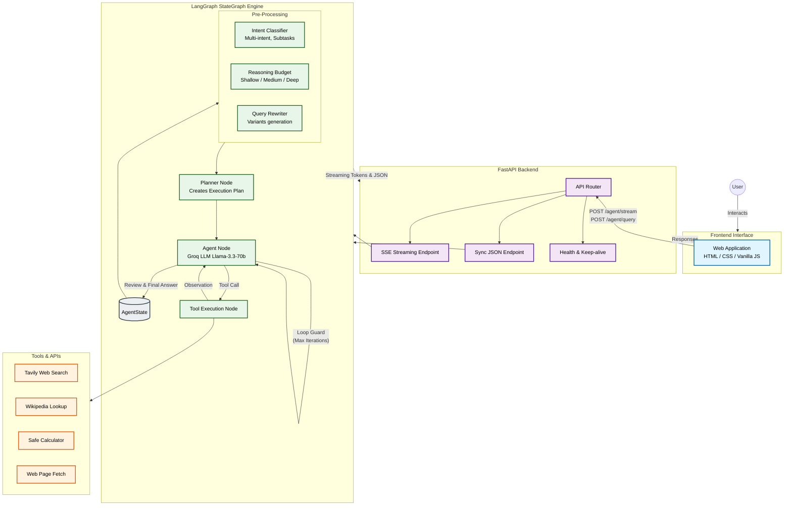

# LangGraph ReAct Agent

A high-precision reasoning agent built using LangGraph and Groq that performs multi-step reasoning, handles complex multi-intent queries, and enforces factual grounding via tool-augmented search.

The system is designed for **learning, comparison, and structured reasoning tasks**, rather than general-purpose question answering.

It includes a browser frontend served from the same FastAPI app, so the health endpoint, structured query endpoint, and streaming endpoint can be tested from one page.

## Architecture



### LangGraph State Machine (ASCII)

```
START
  |
  v
planner
  |
  v
agent <--> tools
  |
  v
evidence_pack_builder
  |
  v
review
  |
  v
validate ---- retry ----> agent
  |
  v
timeout/fallback -----> END
```

## Features

- **Multi-intent routing (Work in Progress)**: Task-splitting for complex queries (e.g., "explain X and calculate Y").
- Intent-aware tool routing for explanatory, SOTA, comparative, technical, and discovery queries.
- Hardened factual grounding: forces tool usage for factual queries and rejects "unknown" hallucinations.
- Four tools: Tavily web search, Wikipedia lookup, safe calculator, and page fetch.
- Structured JSON response with traceability and execution metrics.
- Budget-aware memory recall (medium/deep budgets) with an opt-out via `MEMORY_ENABLED=false`.
- Final answer review pass to reduce misleading or overly general claims.
- Intent-specific answer templates for comparison questions and ML-learning style explanations.
- SSE streaming endpoint for token events and a final payload containing trace + sources.

## What This System Does Well

This agent performs best on tasks that require:

- **Structured comparison**
  - Example: CNN vs GNN, Ridge vs Lasso
  - Uses table-based outputs and tradeoff reasoning

- **Learning-style explanations**
  - Example: RAG, PCA, neural networks
  - Produces intuition + steps + examples

- **Tool-augmented reasoning**
  - Uses web search and Wikipedia to ground responses
  - Performs multi-step reasoning using a ReAct loop

- **Traceable outputs**
  - Returns tool usage, reasoning steps, and execution trace

## Current Limitations

- **Confidence scoring is conservative**
  - Often returns "low" even for acceptable answers
  - Based on source quality heuristics rather than semantic correctness

- **Grounding is partial**
  - Retrieved sources may be noisy or weak
  - The system does not fully verify consistency across sources

- **Conceptual depth varies**
  - Works well for common topics
  - Can produce shallow or partially incorrect explanations for niche or emerging concepts

- **Tool usage is not always optimal**
  - The agent may retrieve irrelevant results, including mismatched Wikipedia pages
  - Retrieved evidence is not strongly filtered before answer generation

- **Latency**
  - Typical response time is around 5 to 8 seconds
  - The delay comes from multi-step reasoning plus external tool calls

## Design Decisions

- **ReAct architecture**
  - Enables step-by-step reasoning with tool interaction

- **Structured answer templates**
  - Improves consistency for comparisons and explanations

- **Validation and review loop**
  - Reduces unsupported or overly confident claims

- **Intent-aware routing**
  - Different query types trigger different response formats

## Observability with LangSmith

When `LANGSMITH_API_KEY` is set (and `LANGSMITH_TRACING=true`), every `/agent/query` and `/agent/stream` run emits a LangSmith trace.
The trace includes:

- Planner routing decisions and computed reasoning budget
- Tool calls + raw tool outputs (Tavily, Wikipedia, page fetch, calculator)
- Evidence pack aggregation and critic issues (deep budget)
- Review/validation retries and any fallback stop reason

Typical trace flow: `planner -> agent -> tools -> evidence_pack_builder -> review -> validate`.

## Observed Performance

From manual testing:

- Iterations per query: typically 2 to 3
- Latency: typically around 6 to 8 seconds
- Tool usage: search and Wikipedia are used in most knowledge queries
- Confidence: often reported as "low" because scoring is conservative

Example behaviors:

- Comparison queries: strong structure and clearer tradeoff summaries
- Explanation queries: good intuition, but depth can be uneven
- Niche concepts: partial correctness with lower confidence

## Setup

Copy the environment template and add your API keys:

```bash
cp .env.example .env
```

Fill in `GROQ_API_KEY` and, if you want web search, `TAVILY_API_KEY`.

To enable LangSmith tracing, also set:

- `LANGSMITH_API_KEY`
- `LANGSMITH_TRACING=true`
- `LANGSMITH_PROJECT` (optional, defaults to `default` if unset)

Optional runtime controls:

- `MEMORY_ENABLED=false` to disable local memory writes.
- `MAX_WALL_TIME_S=60` to enforce a hard stop for long chains.

## Reliability Guardrails

The system includes several mechanisms to reduce misleading or unsupported outputs, but it does not guarantee correctness.

These include:

- A fixed answer structure for comparison questions: Definition, Intuition, Table comparison, Use cases, Key insights.
- A fixed answer structure for learning-style questions: Intuition, Step-by-step process, Formula, Example, Key insights.
- **Factual Grounding Guardrails**: If an intent is classified as `fact`, the agent is prohibited from answering without invoking a search tool. Missing-evidence answers trigger a retry (budget permitting).
- **Task Isolation (WIP)**: Multi-intent subtasks are separated by scoped instructions, but still share the same message history.
- **Uncertainty handling**: when evidence is weak or mixed, prefer neutral phrasing over definitive conclusions.
- **A final answer review pass** that rewrites statements that appear misleading, overly broad, or overconfident.
- **Technical grounding** through the current tool set, with graceful fallback behavior when source retrieval is weak or unavailable.
- **Tool failure fallback**: Tavily no-hit results fall back to a Wikipedia summary when possible.
- **Hard stop fallback**: If max iterations or wall time is exceeded, return a safe fallback response.

For stricter technical accuracy, the next routing upgrade should add paper and documentation sources such as arXiv summaries, official docs, Stanford CS notes, or DeepLearning.ai material.

This is effectively a simple self-critique loop:

1. Generate an answer.
2. Review it for unsupported claims.
3. Revise it if needed.

Use these depth prompts when you want a fuller explanation:

- "Explain like I'm learning ML"
- "Give intuition + math + example"
- "Be concise"

## Project Positioning

This project is not a general-purpose chatbot.

It is a **tool-augmented reasoning system** designed for:

- structured comparisons
- learning-oriented explanations
- traceable AI outputs

It demonstrates how LLMs can be orchestrated with tools, validation, and structured reasoning to build more reliable AI systems.

## Future Improvements

- Improve confidence scoring using semantic relevance instead of domain heuristics
- Add better filtering and ranking of retrieved sources
- Improve memory relevance (e.g., vector memory or stricter recall filters)
- Add domain-specific tools such as research paper and documentation retrieval
- Improve reasoning over retrieved evidence instead of relying primarily on direct generation

## Run Locally

### With Python

```bash
python -m uvicorn api.app:app --reload --host 0.0.0.0 --port 8000
```

### With Docker

```bash
docker build -t langgraph-react-agent .
docker run --rm -p 8000:8000 --env-file .env langgraph-react-agent
```

Then open http://127.0.0.1:8000/ in your browser.

## Endpoints

- `GET /ping` - simple keep-alive check (no dependencies).
- `GET /health` - service and dependency status.
- `GET /` - browser frontend.
- `POST /agent/query` - structured agent response.
- `POST /agent/stream` - server-sent event stream.

## Example Request

```json
{
  "query": "What is RAG in AI?",
  "max_iterations": 5
}
```

## Example Response

```json
{
  "answer": "RAG (Retrieval-Augmented Generation) is ...",
  "intent": "explanatory",
  "tools_used": ["wikipedia_lookup"],
  "iterations": 2,
  "latency_ms": 1200.5,
  "trace": [
    {
      "thought": "User wants a definition.",
      "action": "wikipedia_lookup",
      "observation": "RAG is a technique that combines retrieval and generation..."
    },
    {
      "thought": "I have enough information to answer.",
      "action": "FINISH",
      "observation": null
    }
  ]
}
```

## Validation

Run the unit tests with:

```bash
python -m unittest discover -s tests
```

Run linting with Ruff:

```bash
python -m ruff check .
```

CI runs Ruff + unit tests on push/PR via `.github/workflows/ci.yml`.

Run the benchmark evaluation harness with:

```bash
python evals/run_eval.py
```

Notes:

- Cases that require live LLM/tool calls are auto-skipped when provider credentials/network are unavailable.
- The script still evaluates deterministic offline cases (for example, ambiguous and calculator routing).

Optional flags:

- `--cases evals/benchmark_cases.jsonl`
- `--output evals/latest_eval_report.json`
- `--model-name llama-3.3-70b-versatile`
- `--reasoning-budget shallow|medium|deep`

Then use the browser UI to validate the full flow:

1. Open the root page at http://127.0.0.1:8000/.
2. Click Refresh health and confirm the backend reports status, model, and tool availability.
3. Try the sample chips for explain, compare, SOTA, calculate, and discovery queries, then switch the Budget selector to Shallow, Medium, or Deep.
4. Click Run query to verify the structured answer, trace, and raw JSON.
5. Click Stream answer to verify the SSE path and live token output.

## Troubleshooting

If you see `ModuleNotFoundError: No module named 'langchain_core'`, you are running the base Anaconda Python instead of the project environment. Use either `conda run -n langgraph-react-agent ...` or open a shell where the prompt shows the `langgraph-react-agent` environment before starting Uvicorn.

## Deployment

The system is optimized for Docker deployment on Render's free tier. It includes a built-in background task (`_keep_alive_loop`) that automatically pings the server to prevent idle spin-down.

To deploy on Render:
1. Connect this GitHub repository as a "Blueprint" instance using the `render.yaml` file.
2. Provide your API keys (`GROQ_API_KEY`, `TAVILY_API_KEY`) when prompted.
3. Render will automatically build the Docker image and expose port 8000.
